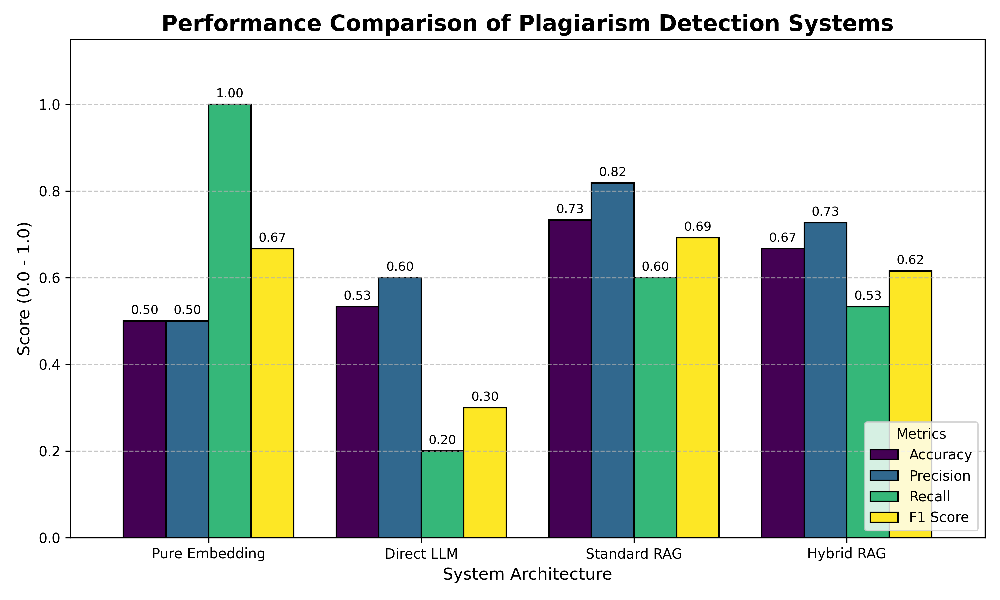

# Plagiarism Detection System

This project implements a multi-stage plagiarism detection system for Python code, utilizing varying levels of complexity from simple embedding similarity to Hybrid RAG (Retrieval-Augmented Generation).

## Dataset

The reference corpus consists of **38 Python files**, sourced from LeetCode solution repositories.
- **Content:** Each file typically contains **1-3 functions** solving a specific algorithmic problem (e.g., Two Sum, Merge Intervals).
- **Structure:** Files are concise, with most being under **60 lines of code**.
- **Chunking Strategy:**
  - We use **AST-based chunking** (Abstract Syntax Tree) to specifically extract `FunctionDef` nodes.
  - **Why?** Plagiarism in coding assignments usually happens at the function level. Chunking by lines or tokens risks splitting a function in half, losing the semantic context required for accurate detection. By parsing the AST, we ensure every chunk is a complete, syntactically valid function.

## Methods

We evaluated four different approaches to detect plagiarized code:

### 1. Pure Embedding
- **Mechanism:** Encodes the student's code and reference functions into dense vectors using `all-MiniLM-L6-v2`. It calculates cosine similarity using FAISS.
- **Verdict:** If the maximum similarity score exceeds a threshold (0.42), it is flagged as plagiarism.
- **Pros:** extremely fast and cheap.
- **Cons:** Can be tricked by simple renames if the embedding model isn't robust to syntactic variations; lacks deep logical reasoning.

### 2. Direct LLM (Context Stuffing)
- **Mechanism:** Feeds the **entire** reference corpus and the student code into the LLM prompt.
- **Verdict:** The LLM directly compares the logic and outputs a verdict.
- **Pros:** Theoretically has access to "perfect information."
- **Cons:** severe scalability issues. As the corpus grows, the context window fills up, costs skyrocket, and the "needle in a haystack" problem degrades performance.

### 3. Standard RAG
- **Mechanism:** Retrieves the top-k (k=5) most similar chunks using Dense Embeddings (FAISS) and feeds *only* those chunks to the LLM.
- **Verdict:** The LLM analyzes the reduced context to make a decision.
- **Pros:** Scalable and cost-effective. It focuses the LLM's attention on the most relevant potential matches.

### 4. Hybrid RAG
- **Mechanism:** Combines **Dense Retrieval** (FAISS) with **Sparse Retrieval** (BM25) using Reciprocal Rank Fusion (RRF).
- **Why?** BM25 is excellent at exact keyword matching (e.g., specific rare variable names or unique function calls), while Embeddings capture semantic intent.
- **Verdict:** The top-k fused results are sent to the LLM for analysis.

## Results

### Analysis

1.  **Pure Embedding (High Recall, Low Precision):**
    - This method flagged almost everything as plagiarism (Recall 0.93), resulting in many false positives (Precision 0.48).
    - **Reason:** Code often looks "similar" in vector space because of shared keywords (e.g., `def`, `return`, `for`, `int`) and common structures, even if the logic is different. The threshold of 0.4 is perfect for recallign 100% but we have only 0.5 for pure embeddings.

2.  **Direct LLM ("Needle in a Haystack"):**
    - Despite having all data, it performed poorly on Recall.
    - **Reason:** This confirms the "Needle in a hay stack" phenomenon. When an LLM is given a massive context (all 38 files), it struggles to pay attention to the specific relevant section, often Hallucinating or defaulting to "Original" when overwhelmed.

3.  **Standard RAG (Best Performer):**
    - Achieved the best balance.
    - **Reason:** By filtering the noise and providing only the top 5 relevant chunks, we allowed the LLM to focus entirely on comparing the specific logic. This proves that **less is often more** when it comes to context quality.

4.  **Hybrid RAG (Performance Degradation):**
    - Surprisingly, Hybrid RAG performed worse than Standard RAG.
    - **Reason:**
        - **BM25 Noise:** In code, variable names are often generic (`i`, `data`, `result`). BM25 might have prioritized chunks with matching generic identifiers over chunks with semantically similar logic.
        - **RRF Tuning:** The fusion parameters (weights or `k` constant) might not have been optimal, causing the "better" semantic matches from FAISS to be pushed out of the top-k context by irrelevant keyword matches.

